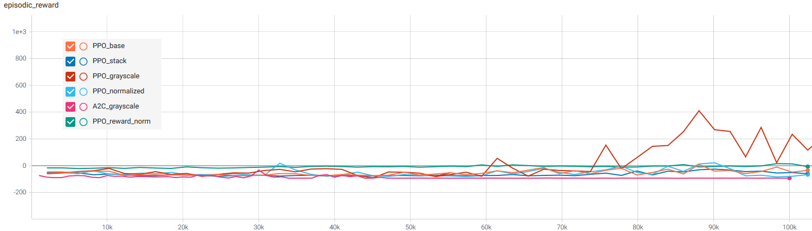
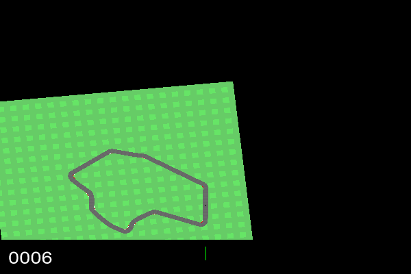

# CarRacing-v0

Reinforcement learning on the example of CarRacing-v0 environment from OpenAI Gym (https://gym.openai.com/). Existing implementations of RL Agents used in this project were taken from StabeBaselines3 library (https://stable-baselines3.readthedocs.io).

## CarRacing-v0 

## Experiments
Following preprocessings and algorithms were tested during experimentation phase:
1. **Preprocessing**: frame stacking, input image grayscaling, input image normalization, reward normalization 
2. **Algorithms**: PPO and A2C

Final performance of the agents was measured with the episodic reward averaged over 10 evaluation gameplays. Training was performed over 100000 steps for each tested configuration. Best resulting model was later usesd in a longer learning process.

## Results

### Episodic reward through time

### Configuration comparision

| Model | Preprocessing | Mean reward | Reward Std Dev |
| --- | --- | --- | --- |
| PPO | None | -21.4 | 14.14 |
| PPO | 4 frame stacking | -42.44 | 12.00 |
| PPO | Image normalization | -48.98 | 19.02 |
| PPO | Image to grayscale | 152.69 | 89.23 |
| PPO | Reward normalization | 67.83 | 98.67 |
| A2C | Image to grayscale | -93.03 | 0.32 |

As can be seen on collected data grayscaling and reward normalization were the only preprocessing steps that noticeably influenced agent performance in a positive way.

Out of 2 tested RL algorithms A2C did not manage to learn the environment. In fact after approximately 50k steps algorithm reached lowest recorded episodic reward (~-92) and remained stable around that value for the remainder of the learning process. On the other hand PPO, around the same time, started showing a positive, increasing trend in episodic rewards.

### Best model

The configuration with the highest episodical reward (PPO with grayscaled image) was trained through 400k timesteps. Achived results:
- mean reward: 622.11
- std dev reward: 241.77

Gameplay:

## Instalation
Conda environment can be recreated with *environment.yml* file (`conda create -f environment.yml`).

In order to use GPU Cuda has to be installed.

Main pipeline can be found in Jupyter notebook `car_racing.ipynb`.

##

*\* Thanks to the long experiemnts Memory Leak was found in implementation of PPO algorithm.*